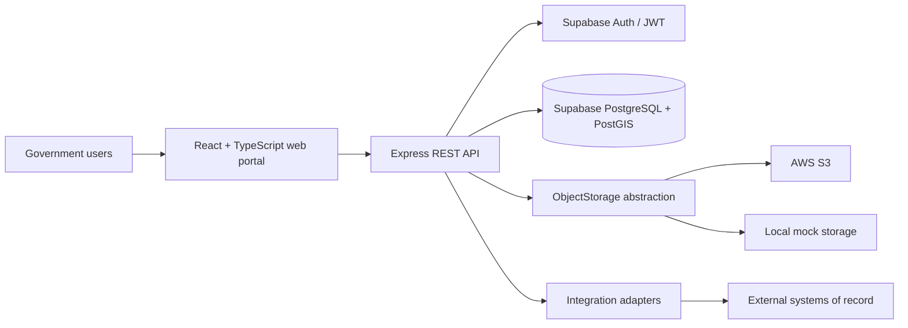
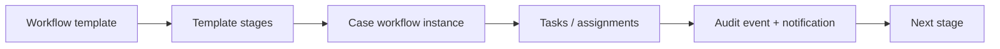
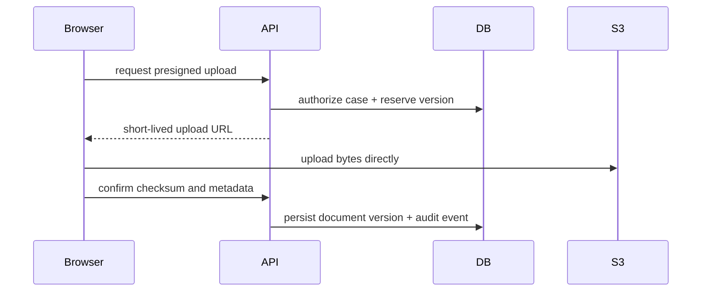
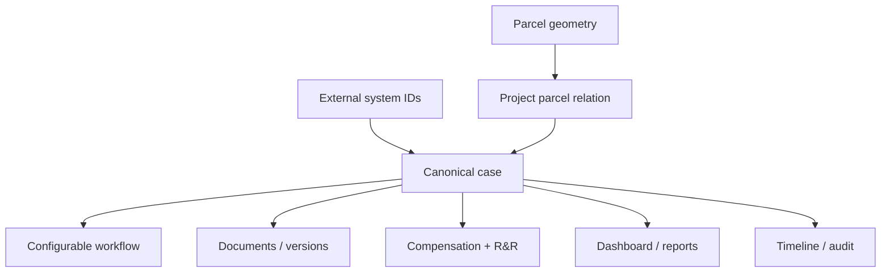

# N-LAMS Architecture

N-LAMS is a national integration and orchestration layer. Existing departmental, state land-record, PFMS, Bhoomi Rashi, and railway systems remain authoritative systems of record; N-LAMS maintains a canonical monitoring view, workflow state, document metadata, and audit history.

## System architecture

The browser never receives service-role credentials or AWS secrets. Privileged operations pass through the API and are also constrained by PostgreSQL RLS in Supabase deployments.

## Database architecture

The canonical model uses UUID primary keys and normalized entities: `projects`, `parcels`, `project_parcels`, `acquisition_cases`, workflow tables, document/version tables, compensation, R&R, external references, notifications, and append-oriented audit logs. PostGIS geometry is preserved on cadastral parcels; partial acquisition is represented by `project_parcels.affected_geometry` and `required_area`, never by mutating the source parcel.

## Authentication architecture

Supabase Auth owns email/password, verification, password reset, sessions, and future MFA enrollment. The API validates bearer access tokens with Supabase and derives the user's profile and roles. The local demo mode uses a clearly marked demo session so the UI is runnable without cloud credentials.

## RBAC model

Roles are data, not UI conditionals: `SUPER_ADMIN`, `NATIONAL_ADMIN`, `DEPARTMENT_ADMIN`, `PROJECT_OFFICER`, `DISTRICT_OFFICER`, `FIELD_OFFICER`, `REVIEWER`, and `VIEWER`. API middleware maps permissions to route intent, while RLS policies in `supabase/migrations/001_initial_schema.sql` enforce row access for direct database clients.

## Workflow model

Workflow templates define ordered stages, responsible roles, required documents, approval rules, and escalation metadata. Case workflow instances and tasks capture runtime assignment, dates, remarks, status, and the event trail. No legal workflow is hard-coded by project type.

## GIS architecture

React-Leaflet renders a map tile layer, project alignment, preserved cadastral polygons, affected geometry, and status styling from one centralized map palette. Search and filtering are API concerns. Supabase uses PostGIS geometry columns and GiST indexes.

## Document storage architecture

PostgreSQL stores document metadata and immutable version rows. Object bytes live behind `ObjectStorage`, with `S3Storage` generating short-lived presigned URLs and `LocalStorage` supporting development. The version key is `n-lams/projects/{projectId}/cases/{caseId}/documents/{documentId}/v{version}/file`.

## Integration architecture

Adapters implement canonical interfaces such as `LandRecordsAdapter`, `AcquisitionSystemAdapter`, and `PaymentSystemAdapter`. The MVP ships `MockLandRecordsAdapter`, `MockAcquisitionAdapter`, and `MockPfmsAdapter`, explicitly labelled DEMO / MOCK in the UI. Production adapters can be added without changing canonical tables.

## Security model

Helmet, CORS, rate limiting, structured request logging, Zod validation, centralized errors, short-lived storage URLs, secure cookies/session handling through Supabase, backend RBAC, and database RLS form the baseline. Audit rows are append-only to application users, and document versions use soft deletion/superseding rather than silent overwrite.

## Data flow

